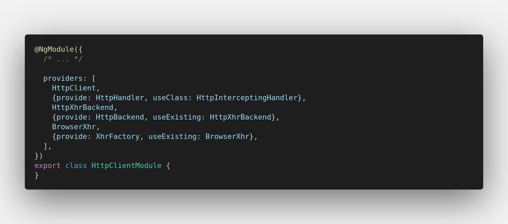

## Let's start exploring 🚧


---

### HttpClientModule

* [HttpClient](#httpclient)
* [`HttpHandler` and `HttpInterceptingHandler`](#httphandler-and-httpinterceptinghandler)

These are the *services* this module provides:




#### HttpClient

With the help of this service, we are able to specify how we want to communicate with the server. It comprises the methods for the well-known HTTP verbs:


<!-- TODO: add link for `DI token` -->
* `HttpHandler` - a **DI token** which maps to `HttpInterceptingHandler`; a detailed explanation can be found here: [`HttpHandler` and `HttpInterceptingHandler`](#httphandler-and-httpinterceptinghandler)

* `addBody(options, body)` - function simply **merges** the provided 2 objects(`options` & `body`) into a single object


```

[_Original source here_](https://github.com/angular/angular/blob/8.2.x/packages/common/http/src/client.ts#L100)

The most significant line here is this one:
```typescript
of (req).pipe(concatMap((req: HttpRequest<any>) => this.handler.handle(req)));
```

There are a few things that can be deduced from the above snippet:

<!-- TODO: reference link to the code -->
* we can know for sure that if the request has completed successfully, the observable will complete, due to `of`'s nature

<!-- TODO: link to the interceptors' section -->
* `this.handler.handle(req)` will return an observable as well, which explains why it used along with the `concatMap` operator; here is where the **interceptors** are **composed and applied** to the request

_Back to [HttpClientModule](#httpclientmodule)_.

---

#### `HttpHandler` and `HttpInterceptingHandler`

The `HttpHandler` is a DI token that maps to `HttpInterceptingHandler`.

```typescript
export abstract class HttpHandler {
  abstract handle(req: HttpRequest<any>): Observable<HttpEvent<any>>;
}

/* ... */

@Injectable()
export class HttpInterceptingHandler implements HttpHandler {
  private chain: HttpHandler|null = null;

  constructor(private backend: HttpBackend, private injector: Injector) {}

  handle(req: HttpRequest<any>): Observable<HttpEvent<any>> {
    if (this.chain === null) {
      const interceptors = this.injector.get(HTTP_INTERCEPTORS, []);
      this.chain = interceptors.reduceRight(
          (next, interceptor) => new HttpInterceptorHandler(next, interceptor), this.backend);
    }
    return this.chain.handle(req);
  }
}
```

<!-- TODO: add link to HttpBackend and HttpXhrBackend -->
`HttpBackend` is a DI token that maps to `HttpXhrBackend`; here is where the HTTP request is performed

##### HttpInterceptingHandler.handle()

It is the method that is called in the [`HttpClient.request`](#httpclientrequest):

```typescript
of (req).pipe(concatMap((req: HttpRequest<any>) => this.handler.handle(req)));
```

As you can see, here we are able to inject the `HTTP_INTERCEPTORS` token that will help us to gather all the interceptors.

The next step consists of creating the **interceptors chain**.

<!-- 
* linked list analogy
  * node: HttpInterceptorHandler
* explain the observable chain
* create one from scratch
* add image
-->

_Back to [HttpClientModule](#httpclientmodule)_.

---

## Connecting the dots

## Try it yourself

<!-- Notes -->

### Other topics
* how does Angular send the HTTP requests?
* the 2 ways of creating a header
* why not to import the HttpClientModule twice
* retry intercetpro(line: 487)
* understanding the `reduceRight` method and eventually why it has been used
* understanding the flow of the request
* how does Angular aborts requests ? `xhr.abort()`
* why should the module be imported only once, in the `AppModule` ?

### HttpInterceptingHandler
  * explain(if u haven't doen it already), to the this class got there
  * explain `HTTP_INTERCEPTORS`
  * everything starts when `res$` is subscribed to(by using `httpClient.{get|post|etc...}.subscribe()`)
  * `events$` is part of res, so when `res$` is subscribed to, the logic inside `events$` will run
  * explain using the linked list analogy

### HTTP_INTERCEPTORS
* where it comes from
* explain what's inside that file(the interface, the )
* `HttpInterceptorHandler`
* why `next.hadle(req).pipe(/* access the response here */)`
* how does **retrying** work?

### leafs
  * `HttpHeaders`
    * headers instance
    * headers obj
    * string: split by `\n`
    * when `typeof headers === 'string'`
      * when an instance is created from  `partialFromXhr()`
  * `HttpParams`
  * `HttpRequest` - creating the actual request object
    * `third`(body, if body not specified(`GET`), this will be the `options`)
    * `fourth`(if body is specified as `third`, this will be the `options`)
  * `HttpResponse`
    * `HttpEvent`
  * `HttpHeaderResponse`
    * partial response(no body)
    * when **progress events** are **requested**

## TODO

- [ ] provide breakpoints in order to understand the flow
- [ ] check the existence of `X-XSRF-TOKEN` in network tab

```typescript
backend = {
  handle (req): Observable<any> { }
}

class InterceptorHandler () {
 constructor () { }
 
 handle (req) { }
}


[ i1, i2, i3 ].reduceRight((next, i) => new InterceptorHandler(i, next), backend) 


o1 = intHandl(i3, be)

o2 = intHandl(i2, o1)

o3 = intHandl(i1, o2);

o3.handle(req)
```

## TODO

* add links between sections

* try the `retry` stuff
```typescript
// Start with an Observable.of() the initial request, and run the handler (which
    // includes all interceptors) inside a concatMap(). This way, the handler runs
    // inside an Observable chain, which causes interceptors to be re-run on every
    // subscription (this also makes retries re-run the handler, including interceptors).
    const events$: Observable<HttpEvent<any>> =
      of (req).pipe(concatMap((req: HttpRequest<any>) => this.handler.handle(req)));
```

* `HttpHeaders` - `this.lazyInit()`

* `HttpClientModule` - imported once

* interceptors on lazy-loaded modules

* `switchMap` - how does `aborting a request work!` :)
