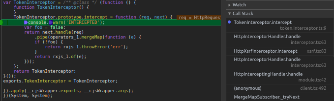
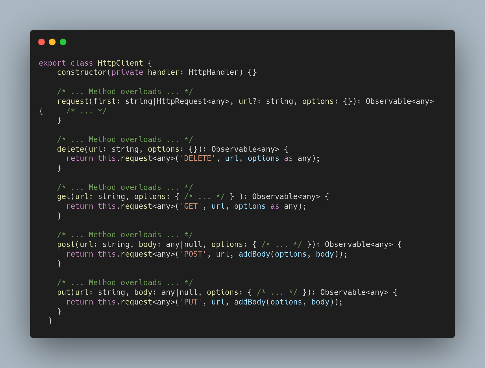
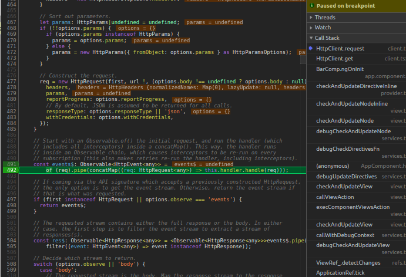
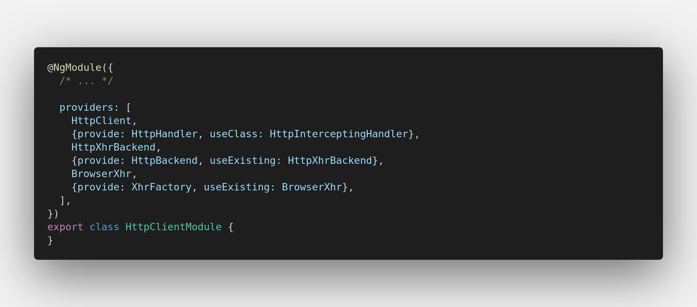
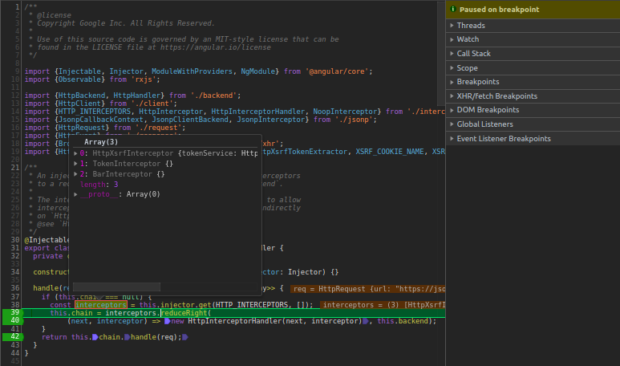
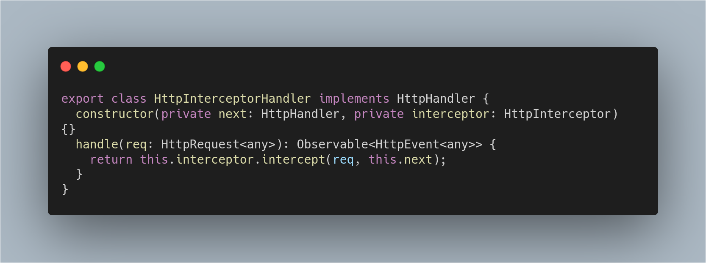
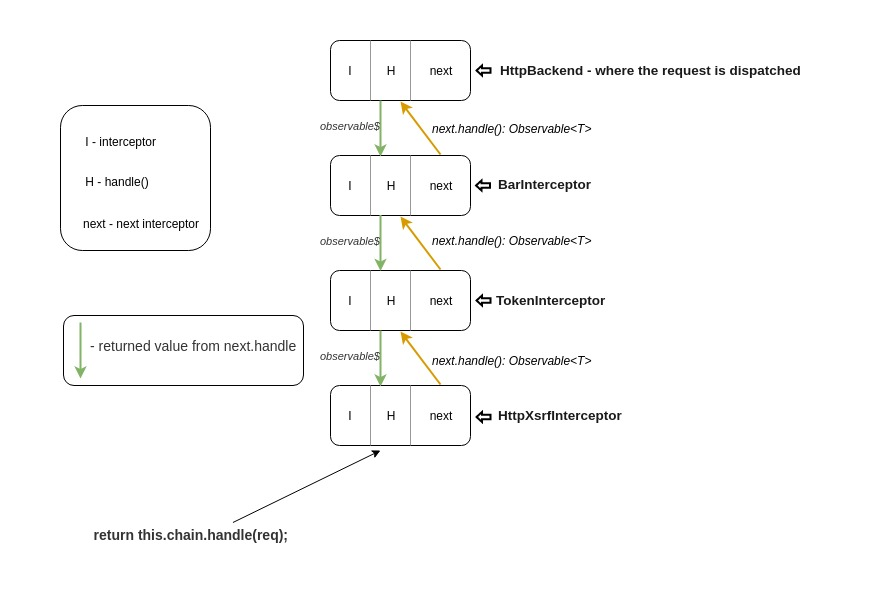
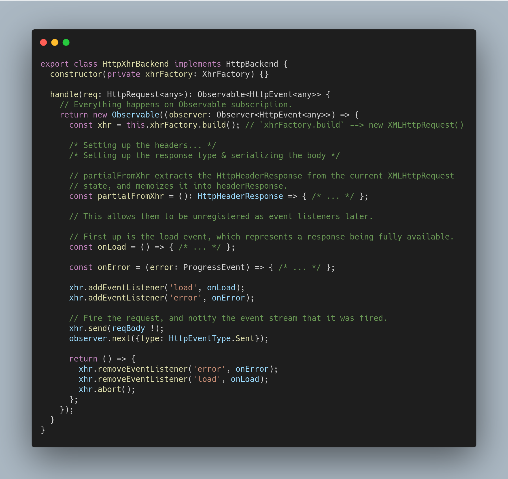
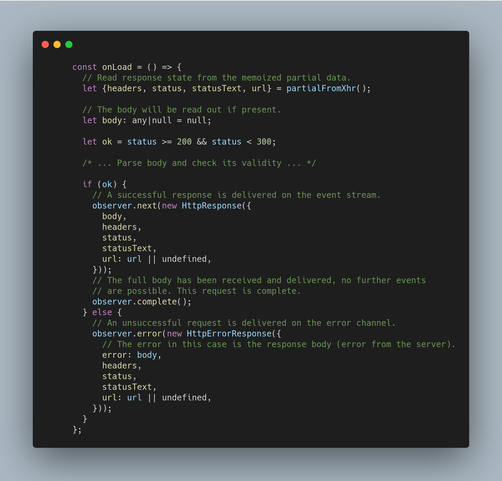

# Exploring the HttpClientModule in Angular

In this post, we are going to understand how the `HttpClientModule` actually works behind the scenes and find answers to some questions that might have arisen while using this module.

_Note: This article is based on **Angular 8.2.x**_.

## Setting up

My favorite way to understand how things really work is by using the debugger while having the source code in my text editor so that I can explore and make assumptions easily.

### Installing Angular on your machine

```bash
git clone -b 8.2.x --single-branch https://github.com/angular/angular.git
```

### StackBlitz

You can find a StackBlitz demo [here](https://stackblitz.com/edit/ng-understanding-http).

We are going to use it throughout the article in order to get a better understanding of how entities are connecting with each other.

---

## What is HttpClientModule?

The `HttpClientModule` is a **service module** provided by Angular that allows us to perform **HTTP requests** and easily manipulate those requests and their responses. It is called a **service module** because it **only instantiates services** and **does not export** any components, directives or pipes.

---

<div style="display: none;" id="start"></div>

## Let's start exploring 🚧

Once in the StackBlitz project:

* open the dev tools

* head over to `token.interceptor.ts`(CTRL + P) and put a breakpoint on `line 9`

* refresh the _StackBlitz browser_

Now, you should see something like this:



By clicking on the _anonymous function_ from `clint.ts`, you are now in the `HttpClient` class, which is the one you usually inject in your services.

As you might have expected, this class comprises the methods for the well-known HTTP verbs.



I'd kindly recommend switching over to your text editor and start exploring this `HttpClient.request` method a little.


Continuing on, put a breakpoint on the `line 492` and refresh the browser. The most interesting part is just about to begin!

<div style="display: none;" id="httpvents"></div>



At this point, we can't step into `this.handler.handle()` because the observable is just being built and has no subscribers yet. So, we must manually set a breakpoint inside the `handle` method.

To do so, switch over to your text editor and scroll up to the `constructor`.
The `HttpHandler` is a **DI token** that maps to `HttpInterceptingHandler`. 

<span id="providers">Here's a list of all providers</span>: 



What's left to do is to go into `HttpInterceptingHandler` class and set a breakpoint inside the `handle` method.

After successufully identifying its location, switch back to your dev tools, add your breakpoint and resume the execution!

<div style="text-align: center;"></div>

_`BarInterceptor` is provided in `app.module`_

Here we are able to grab all the interceptors by injecting the  `HTTP_INTERCEPTOR`(a **multi-provider token**) inside our method.

The next step consists of creating the **injectors chain**.  
But first, let's have a quick look at `HttpInterceptorHandler`:



I like to think of this **chain** as a **linked list** that is built starting off from the **tail node**.

In order to get a better overview of this, I'd suggest that you keep resuming the execution until you reach `line 42`, while paying attention to what's going on in the `Scope` tab.

Now, we can go through the list starting off from the `head node` by stepping into the `handle` function from `line 42`. 

<div id="interceptors"></div>

Here's how this linked list could look like:

<div style="text-align: center;">
    
</div>

Judging by the image above, we can tell that every `next.handle()` **returns** an **observable**.
What this means is that every interceptor can add custom behavior to the returned observable. Those **changes** will **propagate** in the **precedent interceptors**.

Before going any further, let's focus our attention on `this.backend`. Where does it come from? If you take a look at the **constructor**, you should see that is provided by `HttpBackend`, which maps to `HttpXhrBackend`(if not sure why, check [what this module provides](#providers)).

### Let's explore `HttpXhrBackend`

_Setting some breakpoints here and there will definitely lead to a better understanding! :)_

<div id="httphandle"></div>

<div style="text-align: center;">
    
</div>

The first thing that leaps to the eye is the `handle()` method, which is also the last method called in the **interceptor chain** because it sits in the **tail** node. It is also responsible for **dispatching** the request.

* `partialFromXhr` - extracts the `HttpHeaderResponse` from the current `XMLHttpRequest` and memoizes it; this object needs to be computed only once can be used in multiple places. For example, it used in the `onLoad` and `onError` events

* `onLoad` -  the callback function **triggered** when the **response** is **fully available**; it also **parses** and **validates** the **body** of the response

<div style="text-align: center;">
    
</div>

* `onError` - the callback function called when a **network error** occurred during the request

Lastly, it is important to mention that the returned observable from `HttpXhrBackend.handle()` will dispatch the request when we subscribe to one of the `HttpClient`'s methods(`get`, `post` etc). This means that `HttpXhrBackend.handle()` returns a **cold observable**.


* this will get subscribed to through `concatMap`

<!-- IMAGE! -->
```typescript
this.httpClient.get(url).subscribe() -> of(req).pipe(concatMap(req => this.handler.handle))
```

The callback returned from the observable will be **invoked** when the **observable**  **stops emitting** values. That is, when an **error** or a **complete** notification occurs.

<details>
<summary>onComplete</summary>
<br>


```typescript
const obsBE$ = new Observable(obs => {
  timer(1000)
    .subscribe(() => {
      obs.next({ response: { data: ['foo', 'bar'] } });

      // Stop receiving values!
      obs.complete();
    })

    return () => {
      console.warn("I've had enough values!");
    }
});

obsBE$.subscribe(console.log)
/* 
-->
response
I've had enough values!
*/
```
</details>

<details>
<summary>onError</summary>
<br>


```typescript
const be$ = new Observable(o => {
  o.next('foo');

  return () => {
    console.warn('NO MORE VALUES!');
  }
});

be$
 .pipe(
    flatMap(v => throwError('foo')),
 )
  .subscribe(null, console.error)
/* 
-->
foo
NO MORE VALUES
*/
```
</details>

---

Based on the acquired knowledge, we are now able to answer some questions!

## How can a request be canceled?

A common case is the **typeahead** feature:

```typescript
this.keyPressed
    .pipe(
        debounceTime(300),
        switchMap(v => this.http.get(url + '?key=' + v))
    )
```

It is advised to do things this way. The reason is due to `switchMap`'s magic, which will **unsubscribe** from the **inner observable** to handle the next emitted value.

```typescript
const src = new Observable(obs => {
  obs.next('src 1');
  obs.next('src 2');
  
  setTimeout(() => {
    obs.next('src 3');
    obs.complete(); 
  }, 1000);

  return () => {
    console.log('called on unsubscription')
  };
});

of(1, 2)
  .pipe(
    switchMap(() => src)
  )
  .subscribe(console.log)

/* 
src 1
src 2
called on unsubscription
src 1
src 2
src 3
called on unsubscription
*/
```

`1` is emitted and while we are **waiting** for the **inner observable** to complete, another value, `2`, comes straight away and will make `switchMap` unsubscribe from the current inner observable which in turn will invoke the returned function from the observable.

Here is what is going on inside the function returned from the observable that dispatches the request(found in [HttpXhrBackend.handle](#httphandle)):

```typescript
return () => {
    /* Skipped some lines for brevity... */

    xhr.removeEventListener('error', onError);
    xhr.removeEventListener('load', onLoad);
    
    // Finally, abort the in-flight request.
    xhr.abort();
}
```

Thus, we can infer that if the observable that made the request is unsubscribed from, the above callback will be invoked.

---

## How can interceptors retry requests?

A token interceptor might look like this:

```typescript
intercept (req: HttpRequest<any>, next: HttpHandler) {
  /* ... Attach token and all that good stuff ... */

  return next.handle()
    .pipe(
      catchError(err => {
        if (err instanceof HttpErrorResponse && err.status === 401) {
          return this.handle401Error(req, next)
        }

        // Simply propagate the error to other interceptors or to the consumer
        return throwError(err);
      })
    )
}

private handle401Error (req: HttpRequest<any>, next: HttpHandler) {
  return this.authService.refreshToken()
    .pipe(
      tap(token => this.authService.setToken(token)),
      map(token => this.attachToken(req, token))
      switchMap(req => next.handle(req))
    )
}

private attachToken(req: HttpRequest<any>, token: string): HttpRequest<any> {
  return req.clone({ setHeaders: { 'x-access-token': token } })
}
```

The retry logic can be achieved with `switchMap(() => next.handle(req))`.

If we reach the code inside `catchError`, it means that the **consumer** will **unsubscribe** from the **observable**(the one that is returned from [HttpXhrBackend.handle](#httphandle)). 
This will allow us to **re-subscribe** to that observable, which will cause the request to be sent again as well as the interceptors that follow this interceptor to run their `intercept` function again.

Let's narrow it down to a simpler example:

```typescript
const obsBE$ = new Observable(obs => {
  timer(1000)
    .subscribe(() => {
      // console.log('%c [OBSERVABLE]', 'color: red;');

      obs.next({ response: { data: ['foo', 'bar'] } });

      // Stop receiving values!
      obs.complete();
    })

    return () => {
      console.warn("I've had enough values!");
    }
});

// Composing interceptors the chain
const obsI1$ = obsBE$
  .pipe(
    tap(() => console.log('%c [i1]', 'color: blue;')),
    map(r => ({ ...r, i1: 'intercepted by i1!' }))
  );

let retryCnt = 0;
const obsI2$ = obsI1$
  .pipe(
    tap(() => console.log('%c [i2]', 'color: green;')),
    map(r => { 
      if (++retryCnt <=3) {
        throw new Error('err!') 
      }

      return r;
    }),
    catchError((err, caught) => {
      return getRefreshToken()
        .pipe(
          flatMap(() => /* obsI2$ */caught),
        )
    })
  );

const obsI3$ = obsI2$
  .pipe(
    tap(() => console.log('%c [i3]', 'color: orange;')),
    map(r => ({ ...r, i3: 'intercepted by i3!' }))
  );

function getRefreshToken () {
  return timer(1500)
    .pipe(q
      map(() => ({ token: 'TOKEN HERE' })),
    );
}

function get () {
  return obsI3$
}

get()
  .subscribe(console.log)

/* 
-->
[i1]
[i2]
I've had enough values!
[i1]
[i2]
I've had enough values!
[i1]
[i2]
I've had enough values!
[i1]
[i2]
[i3]
{
  "response": {
    "data": [
      "foo",
      "bar"
    ]
  },
  "i1": "intercepted by i1!",
  "i3": "intercepted by i3!"
}
I've had enough values!
*/
```

_[StackBlitz](https://stackblitz.com/edit/rx-playground-3locfw)_

This is, in my view, this is the effect of `next.handle()` inside each interceptor(Image [here](#interceptors)). Imagine that instead of `const obsI3$ = obsI2$` we would have something like this:

```typescript
// Interceptor Nr.2
const next = {
  handle(req) {
    /* ... Some logic here ... */

    return of({ response: '' })
  }
}

const obsI3$ = next.handle(req)
  .pipe(
    map(r => ({ ...r, i3: 'this is interceptor 3!!' })),
    /* ... */
  )
```

`obsI3$` will now be the observable returned by `next.handle()` which means it can add now its own custom behavior and if something goes wrong, it can reinvoke the source observable.

When using interceptors you would want to retry the request by using `switchMap(() => next.handle(req)`(as it is done in the first code snippet), because, besides the each interceptor's returned observable, you would also want to run their logic that sits inside their `intercept()` function.

From this line `switchMap(() => /* obsI2$ */caught)` we can see that `catchError` can have a second argument, `caught`, which is the source observable.(More on this [here](https://github.com/ReactiveX/rxjs/blob/master/src/internal/operators/catchError.ts#L99-L106)).

---

## Why is it sometimes necessary to clone the request object inside an interceptor?

The process of adding the JWT token to your request might look like this:

```typescript
if (token) {
  request = request.clone({
    setHeaders: { [this.AuthHeader]: token },
  });
}

return next.handle(request)
```

The most important reason would be **immutability**. You wouldn't want to mutate the **request object** from multiple places. Thus, every interceptor should configure the request independently.
The cloned request would eventually be passed to the next interceptor in the chain.

---

## Why is it recommended to load the HttpClientModule only once in AppModule or CoreModule?

A lazy-loaded module `A` will create its own child injector which will resolve the `providers` from that module. This means that the **providers provided inside** `A` and those **provided by modules imported by** `A` will be **scoped** to module `A`.

Importing `HttpClientModule` in `A` will result in only **applying** the **interceptors** that are **provided** inside **`A`**, excluding anything that is up in the injector tree. This is because `HttpClientModule` comes with its **own providers** which, as mentioned above, will be scoped to `A`.

```
             { provide: HttpHandler, useClass: ... }
  AppModule {    /
    imports: [  /
      HttpClientModule
    ]
  }
                  { provide: HttpHandler, useClass: HttpInterceptingHandler } <- where interceptors are gathered
  FeatureModule { /  <- lazy-loaded                  |
    imports: [   /                                   |
      HttpClientModule <------------------           |
    ]                                     |          |
                                          |          |
    declarations: [FeatureComponent]       <------------------------
    providers: [                                     |              |
                                                    /               |
      { provide: HTTP_INTERCEPTORS, useClass: FeatInterceptor_1 },  |
      { provide: HTTP_INTERCEPTORS, useClass: FeatInterceptor_2 }   |
    ]                                      ------------------------>
  }                                       |
                                          | httpClient.get()
  FeatureComponent {                      |
    constructor (private httpClient: HttpClient) { }
  }
```


If `HttpClientModule` was **not imported** in `A`, it would **look up** the **injector tree** until it finds the needed providers(in this case, it would be in `AppModule`). This also means that any interceptors provided in `A` will be **excluded**.

---

## How can interceptors be completely bypassed?

### TLDR;

Make sure that `HttpHandler` maps to `HttpXhrBackend`:

```typescript
@NgModule({
  imports: [
    /* ... */
    HttpClientModule,
    /* ... */
  ],
  declarations: [ /* ... */ ],
  providers: [
    /* ... */
    {
      provide: HttpHandler,
      useExisting: HttpXhrBackend,
    },
    /* ... */
  ]
})
export class AppModule { }
```

### Detailed Explanation

_It is recommended to first explore the [HttpClientModule](#start)_.

Whenever you do something like `HttpClient.get()`(or any other **HTTP verb**), the `HttpClient.request()` method will be eventually called. In this method, this line will be reached:

```typescript
const events$: Observable<HttpEvent<any>> =
        of (req).pipe(concatMap((req: HttpRequest<any>) => this.handler.handle(req)));
```

Let's see how `this.handler` is retrieved:

```typescript
@Injectable()
export class HttpClient {
  constructor(private handler: HttpHandler) {}

  /* ... */
}
```

If we take a look at `HttpClientModule`'s providers,

<div style="text-align: center;">
  
</div>

we can tell that `HttpHandler` maps to `HttpInterceptingHandler`:

```typescript
@Injectable()
export class HttpInterceptingHandler implements HttpHandler {
  private chain: HttpHandler|null = null;

  constructor(private backend: HttpBackend, private injector: Injector) {}

  handle(req: HttpRequest<any>): Observable<HttpEvent<any>> {
    if (this.chain === null) {
      const interceptors = this.injector.get(HTTP_INTERCEPTORS, []);
      this.chain = interceptors.reduceRight(
          (next, interceptor) => new HttpInterceptorHandler(next, interceptor), this.backend);
    }
    return this.chain.handle(req);
  }
}
```

`HttpInterceptingHandler` constructs the **interceptor chain**, which will in the end allow us to **apply** all the **registered interceptors** to the request.

We can also see that `HttpInterceptingHandler` **implements** `HttpHandler`:

```typescript
export abstract class HttpHandler {
  abstract handle(req: HttpRequest<any>): Observable<HttpEvent<any>>;
}
```

`HttpHandler` is implemented by `HttpBackend`

```typescript
export abstract class HttpBackend implements HttpHandler {
  abstract handle(req: HttpRequest<any>): Observable<HttpEvent<any>>;
}
```

`HttpBackend` is implemented by `HttpXhrBackend`, which will eventually **send the request** to the server(More on this [here](#interceptors)).

```typescript
@Injectable()
export class HttpXhrBackend implements HttpBackend {
  constructor(private xhrFactory: XhrFactory) {}

  handle(req: HttpRequest<any>): Observable<HttpEvent<any>> {
    /* ... */
  }
}
```
As you can see, both `HttpInterceptingHandler` and `HttpXhrBackend` will have to **implement** the `handle()` method.
Consequently, the solution to this problem would be to make `HttpHandler` map to `HttpXhrBackend`.

```typescript
@NgModule({
  imports: [
    /* ... */
    HttpClientModule,
    /* ... */
  ],
  declarations: [ /* ... */ ],
  providers: [
    /* ... */
    {
      provide: HttpHandler,
      useExisting: HttpXhrBackend,
    },
    /* ... */
  ]
})
export class AppModule { }
```

---

## What is the difference between `setHeaders` and `headers`?

* `setHeaders` appends

* `headers` rewrites

---

## What's the magic behind `HttpHeaders`?

`HttpHeaders` is a class that allows us to manipulate(perform **CRUD operations** on) headers for our requests.

Have a look at this example:

```typescript
const headers = new HttpHeaders({
  foo: 'foo',
  bar: 'bar',
});

const newHeaders = headers
  .append('name', 'andrei')
  .set('city', 'tgv')
  .delete('foo')
  .has('abcd');
```

The magic about this is that it will only initialize the headers(**key-value pairs**) when they are actually needed. That is, when you want to query for their current state(`HttpHeaders.forEach()`, `HttpHeaders.get()` etc...).

Here's how the constructor looks like:

```typescript
if (!headers) {
  this.headers = new Map<string, string[]>();
} else if (typeof headers === 'string') {
  this.lazyInit = () => { /* ... */ }
} else {
  this.lazyInit = () => { /* ... */ }
}
```

As we can see, the `lazyInit` function is initialized in the constructor of `HttpHeaders`.  
As a result, in order to perform actions such as `HttpHeaders.append`, `HttpHeaders.set` or `HttpHeaders.delete`, which would eventually mutate the **initial state** that was provided to the **constructor**, there will be a clone created that will store the new actions(`create` -> `set`, `update` -> `append`, `delete` -> `delete`). 
These **stored actions** will be **merged** with the **initial state**.

Here's how the `HttpHeaders.clone` looks like:

```typescript
// action
interface Update {
  name: string;
  value?: string|string[];
  op: 'a'|'s'|'d';
}

private clone(update: Update): HttpHeaders {
  const clone = new HttpHeaders();
  // Preserve the initialization across multiple clones
  clone.lazyInit =
      (!!this.lazyInit && this.lazyInit instanceof HttpHeaders) ? this.lazyInit : this;
  // Accumulate actions 
  clone.lazyUpdate = (this.lazyUpdate || []).concat([update]);
  return clone;
}
```

Let's understand this logic by using our initial example:

```typescript
const headers = new HttpHeaders({
  foo: 'foo',
  bar: 'bar',
});
/* 
-->
h1.lazyInit = () => {
  // Initialize headers
}
*/

const newHeaders = headers
  .append('name', 'andrei')
  /* 
  -->
  // Creating a clone
  h2.lazyInit = h1 // Preserving the first `instance` across multiple clones
  h2.lazyUpdate = { "name": "name", "value": "andrei", "op": "a" }
  */
  .set('city', 'tgv')
  /* 
  -->
  // Creating a clone
  // h2.lazyInit = h1
  h3.lazyInit = h2.lazyInit // Preserving the first `instance` across multiple clones
  h3.lazyUpdate = [
    { "name": "name", "value": "andrei", "op": "a" }, // append
    { "name": "city", "value": "tgv", "op": "s" } // set
  ]
  */
  .delete('foo')
  /* 
  -->
  // Creating a clone
  // h3.lazyInit = h2.lazyInit
  h4.lazyInit = h3.lazyInit // Preserving the first `instance` across multiple clones
  h4.lazyUpdate = [
    { "name": "name", "value": "andrei", "op": "a" },
    { "name": "city", "value": "tgv", "op": "s" },
    { "name": "foo", "op": "d" }
  ]
  */
  .has('abcd');
  /* 
  -->
  Here is where the initialization takes place
  */
```

The **merging process** would look like this:

```typescript
private init(): void {
  if (!!this.lazyInit) {
    if (this.lazyInit instanceof HttpHeaders) {
      this.copyFrom(this.lazyInit);
    } else {
      this.lazyInit();
    }
    this.lazyInit = null;
    if (!!this.lazyUpdate) {
      this.lazyUpdate.forEach(update => this.applyUpdate(update));
      this.lazyUpdate = null;
    }
  }
}

private copyFrom(other: HttpHeaders) {
  other.init();
  Array.from(other.headers.keys()).forEach(key => {
    this.headers.set(key, other.headers.get(key) !);
    this.normalizedNames.set(key, other.normalizedNames.get(key) !);
  });
}
```

The `HttpHeaders.init()` method is called when querying for the state of the headers(by using methods like `HttpHeaders.get()`, `HttpHeaders.has()`)

In `HttpHeaders.copyFrom()`, `other` will be the first instance of `HttpHeaders`, which contains the initialization logic: `lazyInit`. Calling `other.init()` will eventually reach this part of the `HttpHeaders.init()`: `this.lazyInit();`. Here the initial state is created into the first instance.

We are then left with two other things to do:

1) copy the state of the first instance into this current instance(_last clone_)

2) apply the collected actions onto the copied state.

---
 
* (HttpBackend): explain the response events and how can they be `intercepted`
* jsonp
* progress events
* https://stackoverflow.com/questions/46469349/how-to-make-an-angular-module-to-ignore-http-interceptor-added-in-a-core-module
* check tests
